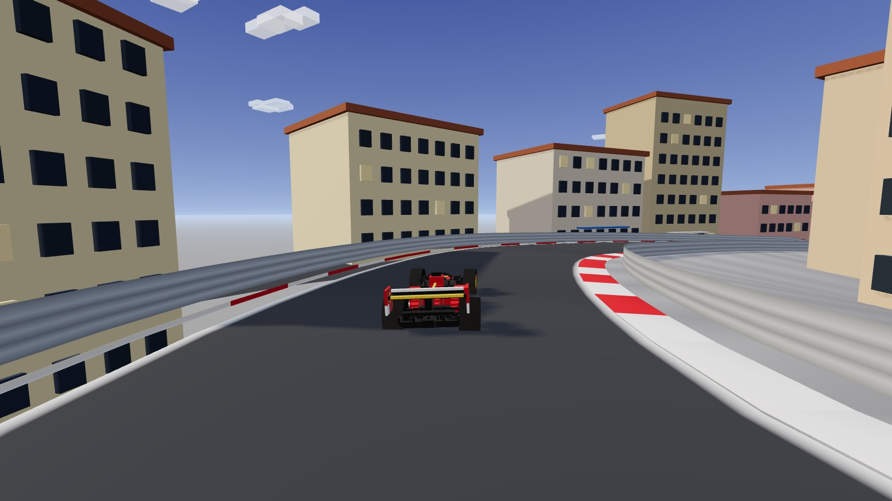
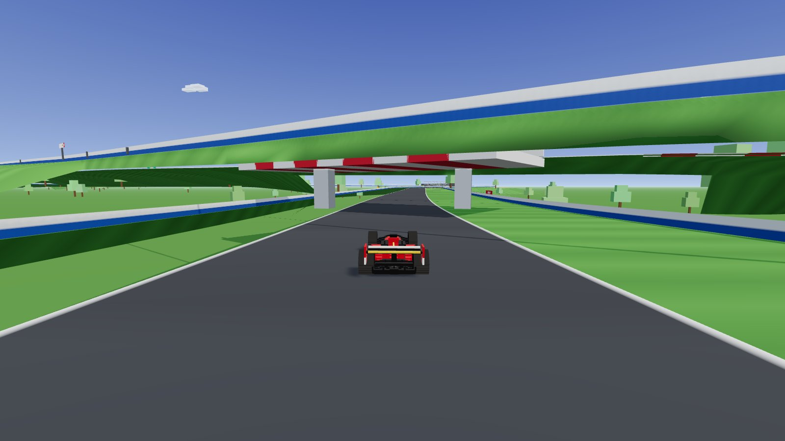
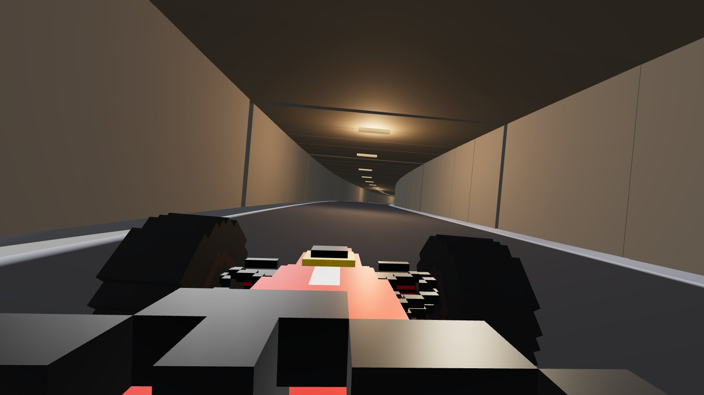
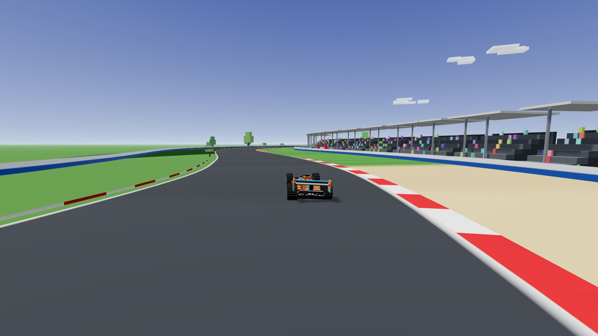

# 🏁 Voxel Grand Prix

**English** | [简体中文](README.zh-CN.md)

[](https://github.com/lwt980916-glitch/voxel-grand-prix/actions/workflows/deploy.yml)
[](LICENSE)
[](https://threejs.org)

A voxel-style Formula 1 racing game that runs entirely in your browser.
All three circuits are rebuilt from **real GPS centerline data** — corner
sequences, track lengths (< 0.4% error) and elevation profiles match the real
thing. No 3D-model or audio assets: every car, grandstand and engine note is
generated from code.

### ▶️ [Play it now](https://lwt980916-glitch.github.io/voxel-grand-prix/)

| | |
|---|---|
|  |  |
| Monaco — cresting Casino Square | Suzuka — under the figure-8 crossover |
|  |  |
| First-person cockpit, Monaco tunnel | Silverstone — Maggotts & Becketts |

## Circuits

| Circuit | Length | Signature features |
|---|---|---|
| 🇲🇨 **Circuit de Monaco** | 3.325 km | Street walls everywhere, +30 m climb to Casino Square, the Fairmont Hairpin (19 m radius), the seafront tunnel, yacht harbor |
| 🇬🇧 **Silverstone** | 5.879 km | Maggotts–Becketts esses, 307 km/h down Hangar Straight, gravel traps, packed grandstands |
| 🇯🇵 **Suzuka** | 5.814 km | The world's only figure-8 F1 track — drive **under** the bridge, then **over** it half a lap later; S Curves, 130R, ferris wheel |

## Features

- **Detailed voxel F1 car** (0.05 m grid, 50k+ vertices): cascaded front wing,
  halo, sidepod inlets, shark fin, wheel covers with soft-compound markings,
  driver helmet, working rain light — and a **DRS flap that actually opens**
- **Physics with real feel**: two-axle bicycle model, aero downforce
  (planted in fast corners, nimble in hairpins), rear friction-circle traction
  (throttle-steer with smoke + skid marks), speed-sensitive steering, slope
  gravity, distinct grip on kerbs / grass / gravel, wall collisions
  — 0–100 km/h in 2.9 s, 320+ km/h with DRS, 2.8 g braking
- **Three cameras** (`C`): chase cam, first-person cockpit (through the halo),
  classic T-cam
- **Full race weekend flair**: five-light start sequence, lap timing with
  checkpoints, persistent best laps, live corner-name callouts, DRS zones,
  wrong-way warning, minimap, demo autopilot (`P`)
- **100% procedural audio** (WebAudio): engine note tied to RPM, wind, tire
  screech, kerb rumble, gearshift blips
- **Fast**: 27–36 draw calls, ~1 ms render per frame

## Controls

| Key | Action |
|---|---|
| `W` / `↑` | Throttle |
| `S` / `↓` | Brake |
| `A` `D` / `←` `→` | Steer |
| `C` | Switch camera (chase → cockpit → T-cam) |
| `R` | Reset to track (voids the lap) |
| `P` | Demo mode (autopilot) |
| `M` | Mute |
| `Esc` | Pause |
| 🎮 | Gamepad supported (left stick + triggers) |

## Development

```bash
npm install
npm run dev      # http://localhost:5173
npm run build    # production build in dist/
```

## How the circuits were built

1. `raw/*.geojson` — real circuit centerlines from
   [bacinger/f1-circuits](https://github.com/bacinger/f1-circuits) (MIT)
2. `npm run data:convert` — projects lon/lat to local meters
   (`src/data/circuits.js`)
3. `npm run data:plot` — renders calibration PNGs with curvature-peak tables,
   used to locate the start line, racing direction and every named corner
   (`src/config.js` stores them as lap fractions, together with hand-tuned
   elevation profiles)
4. `src/track.js` resamples the centerline (2.5 m step), auto-places kerbs
   from curvature, builds walls/run-off, detects the Suzuka figure-8 crossing
   and precomputes a racing speed profile for the autopilot

## Project structure

```
src/
  main.js         game loop, menu, visual sync
  config.js       liveries + per-track data (corners, elevation, DRS…)
  voxel.js        voxel builder → merged BufferGeometry
  carModel.js     the F1 car, wheel and DRS-flap meshes
  physics.js      vehicle dynamics
  track.js        road/kerb/wall geometry, timing samples, queries
  environment.js  sky, sun, crowds, buildings, tunnel, bridge, ferris wheel
  cameras.js      chase / cockpit / T-cam rig
  race.js         start lights, lap timing, autopilot
  hud.js          F1-style HUD + minimap
  audio.js        procedural engine/wind/tire audio
  particles.js    smoke + skid marks
  input.js        keyboard + gamepad
tools/            data conversion & calibration utilities
raw/              source GeoJSON (MIT, bacinger/f1-circuits)
```

## Credits

- Circuit geometry: [bacinger/f1-circuits](https://github.com/bacinger/f1-circuits) (MIT)
- Built with [Three.js](https://threejs.org) and [Vite](https://vitejs.dev)

## License

[MIT](LICENSE)
