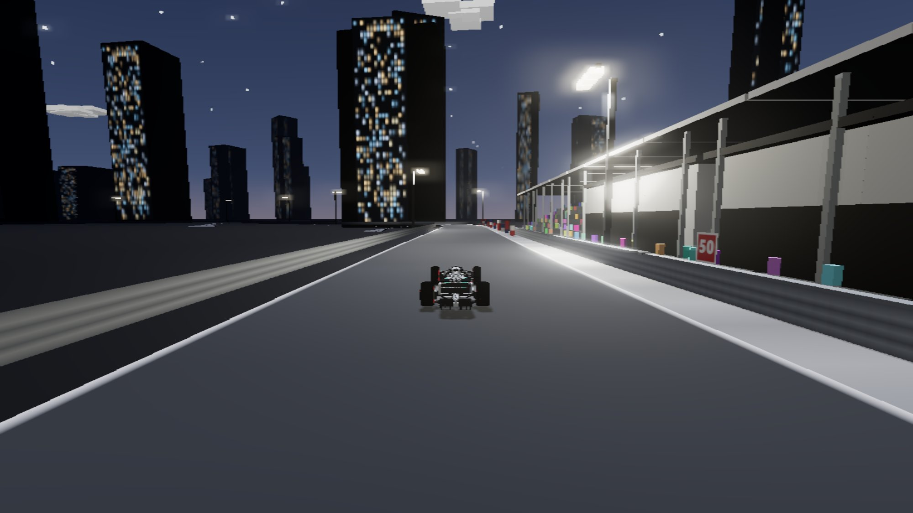
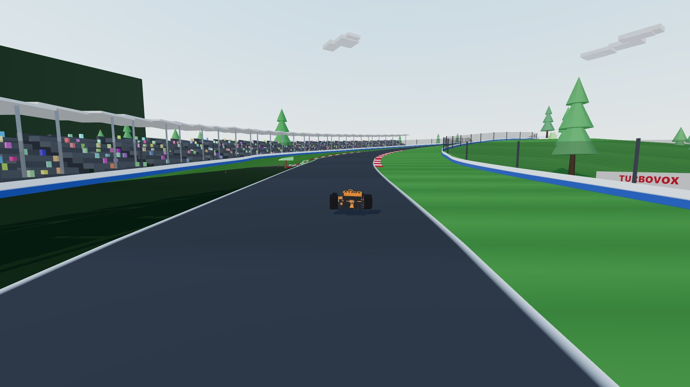
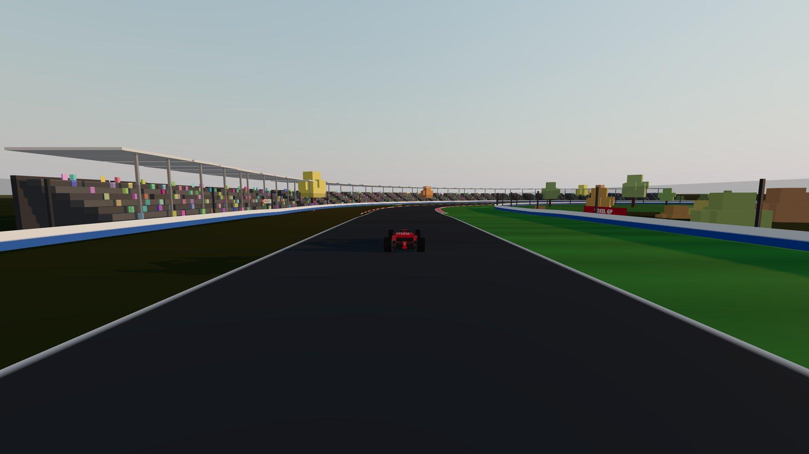
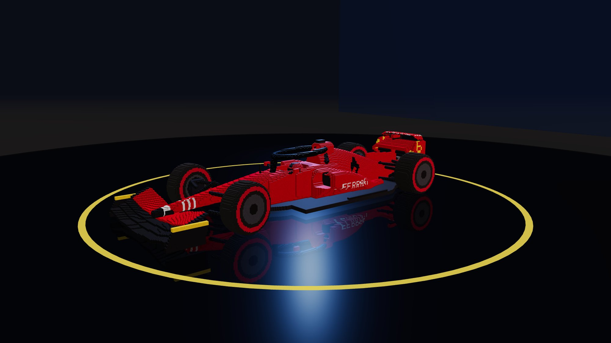

# 🏁 Voxel Grand Prix

**English** | [简体中文](README.zh-CN.md)

[](https://github.com/TaoweNlin/voxel-grand-prix/actions/workflows/deploy.yml)
[](LICENSE)
[](https://threejs.org)

A voxel-style Formula 1 racing game that runs entirely in your browser.
All **six circuits** are rebuilt from **real GPS centerline data** — corner
sequences, track lengths (< 0.4% error) and elevation profiles match the real
thing. No 3D-model or audio assets: every car, grandstand and engine note is
generated from code.

### ▶️ [Play it now](https://taowenlin.github.io/voxel-grand-prix/)

| | |
|---|---|
|  |  |
| Marina Bay at night — floodlights & skyline | Spa — climbing Eau Rouge / Raidillon |
|  |  |
| Monaco — RB18 cresting Casino Square | Suzuka — F1-75 under the figure-8 crossover |
|  |  |
| Onboard T-cam, Monaco tunnel | Monza — golden hour into Parabolica |

## The Garage



The **full 2022 grid — all ten teams** — each **SDF-sculpted**
(implicit-surface part functions sampled onto a 1.6 cm voxel grid — not
box-stacking) with per-vertex ambient occlusion, paint-flake sparkle,
pixel-font decals and team-specific aero philosophies:

| Car | # | Signature bodywork |
|---|---|---|
| 🔵 **Red Bull RB18** | 1 | Downwash sidepods, charging-bull & rising-sun decals |
| 🔴 **Ferrari F1-75** | 16 | "Bathtub" scooped sidepods, prancing-horse silhouette |
| ⚪ **Mercedes W13** | 44 | Radical zero-pod concept, teal floor edge, three-pointed star |
| 🟠 **McLaren MCL36** | 4 | Deep undercut sidepods, speedmark swoosh |
| 🔷 **Alpine A522** | 14 | French blue with BWT pink flashes |
| 🟢 **Aston Martin AMR22** | 5 | Racing-green "green Red Bull" B-spec |
| 💙 **Williams FW44** | 23 | Boxy slab-sided pods, electric blue |
| 🍷 **Alfa Romeo C42** | 77 | Burgundy rear flowing into a white nose |
| 🌑 **AlphaTauri AT03** | 10 | Deep navy with crisp white lines |
| ⬜ **Haas VF-22** | 20 | White with stars-and-stripes red/blue trim |

The garage is a studio-lit turntable with floor reflection, orbit camera and
a live DRS open/close demo — pick your car there and it's saved for every race.

## Circuits

| Circuit | Length | Signature features |
|---|---|---|
| 🇲🇨 **Circuit de Monaco** | 3.325 km | Street walls everywhere, +30 m climb to Casino Square, the Fairmont Hairpin (19 m radius), the seafront tunnel, yacht harbor |
| 🇬🇧 **Silverstone** | 5.879 km | Maggotts–Becketts esses, 307 km/h down Hangar Straight, gravel traps, packed grandstands |
| 🇯🇵 **Suzuka** | 5.814 km | The world's only figure-8 F1 track — drive **under** the bridge, then **over** it half a lap later; S Curves, 130R, ferris wheel |
| 🇧🇪 **Spa-Francorchamps** | 6.978 km | La Source, the 40 m Eau Rouge/Raidillon climb, Kemmel Straight, double-left Pouhon — carved through a conifer forest under Ardennes skies |
| 🇮🇹 **Monza** | 5.787 km | Temple of Speed at golden hour: Rettifilo, the Lesmos, Ascari and Parabolica in an autumn royal park (blimp included) |
| 🇸🇬 **Marina Bay** | 4.944 km | F1's original night race, run anticlockwise: floodlight pylons with pooled lighting, lit skyscraper skyline, bloom-glowing neon |

## Features

- **SDF-sculpted voxel F1 cars** (~350k voxels / ~177k faces in the garage,
  auto-LOD for racing): cascaded front wing, halo, suspension capsules,
  driver helmet, brake ducts, diffuser strakes, working rain light — and a
  **DRS flap that actually opens**
- **Physics with real feel**: two-axle bicycle model, aero downforce
  (planted in fast corners, nimble in hairpins), rear friction-circle traction
  (throttle-steer with smoke + skid marks), speed-sensitive steering, slope
  gravity, distinct grip on kerbs / grass / gravel, wall collisions
  — 0–100 km/h in 2.9 s, 320+ km/h with DRS, 2.8 g braking
- **Four cameras** (`C`): chase cam, first-person cockpit (through the halo),
  classic T-cam, broadcast TV pods
- **Race mode — a real Grand Prix, condensed**: the full ten-team grid,
  a five-light standing start with proper lane discipline through the
  opening pack, 3 laps, live positions and gaps, and a final classification
  screen
- **AI that races like a driver**: every car follows a computed
  **minimum-curvature racing line** (out-in-out, K1999-style curvature
  equalisation) with its own speed profile, keeps a time headway in
  traffic, commits to one side for an overtake and carries the momentum
  through, yields instead of turning into an occupied slot, backs out of
  three-wide squeezes — and gets marshal-lifted when genuinely stuck
- **Full race weekend flair**: five-light start sequence, lap timing with
  checkpoints, persistent best laps, live corner-name callouts, DRS zones,
  wrong-way warning, a minimap showing the whole field as team-colored
  dots, demo autopilot (`P`)
- **Broadcast spectator camera**: trackside TV pods every ~270 m on tall
  masts inside the corners, with pan-and-zoom follow and automatic
  handoff; trees are never planted inside a pod's sight lines, so the
  shot always stays clear — demo mode switches to it automatically, or
  cycle to it with `C`
- **100% procedural audio** (WebAudio): engine note tied to RPM, wind, tire
  screech, kerb rumble, gearshift blips
- **Physically-inspired lighting**: atmospheric-scattering sky
  (turbidity/rayleigh per venue) that is also PMREM-baked into the scene's
  image-based lighting, 4K shadow maps, per-venue sun angles — overcast
  Ardennes, golden-hour Monza, and a full **night-race pipeline** for
  Singapore (star dome, floodlight light-pooling, emissive windows, bloom)
- **Living surroundings**: procedural terrain heightfields flattened along
  the racing corridor, 3200-pine conifer forests, autumn parkland, night
  skyline, tire stacks, catch fences, a drifting blimp and more
- **Fast**: ~70 draw calls, well under 2 ms render per frame

## Controls

| Key | Action |
|---|---|
| `W` / `↑` | Throttle |
| `S` / `↓` | Brake |
| `A` `D` / `←` `→` | Steer |
| `C` | Switch camera (chase → cockpit → T-cam → TV) |
| `R` | Reset to track (voids the lap) |
| `P` | Demo mode (autopilot) |
| `M` | Mute |
| `Esc` | Pause |
| 🎮 | Gamepad supported (left stick + triggers) |

## Development

```bash
npm install
npm run dev      # http://localhost:5173
npm run build    # production build in dist/
```

## How the circuits were built

1. `raw/*.geojson` — real circuit centerlines from
   [bacinger/f1-circuits](https://github.com/bacinger/f1-circuits) (MIT)
2. `npm run data:convert` — projects lon/lat to local meters
   (`src/data/circuits.js`)
3. `npm run data:plot` — renders calibration PNGs with curvature-peak tables,
   used to locate the start line, racing direction and every named corner
   (`src/config.js` stores them as lap fractions, together with hand-tuned
   elevation profiles)
4. `src/track.js` resamples the centerline (2.5 m step), auto-places kerbs
   from curvature, builds walls/run-off, detects the Suzuka figure-8 crossing
   and precomputes both a centerline speed profile and the
   minimum-curvature racing line the AI drivers follow

## Project structure

```
src/
  main.js         game loop, menu, visual sync
  config.js       per-track data (corners, elevation, DRS…)
  carSculpt.js    SDF sculpting engine: parts, decals, AO mesher
  teams.js        the ten team cars (palette, shape params, decals)
  garage.js       showroom scene, turntable, car selection
  voxel.js        box-voxel builder (environment props)
  physics.js      vehicle dynamics
  track.js        road/kerb/wall geometry, timing samples, queries
  environment.js  sky, sun, crowds, buildings, tunnel, bridge, ferris wheel
  cameras.js      chase / cockpit / T-cam / broadcast TV pod rig
  race.js         start lights, lap timing, AI driver brain, collisions
  hud.js          F1-style HUD + minimap
  audio.js        procedural engine/wind/tire audio
  particles.js    smoke + skid marks
  input.js        keyboard + gamepad
tools/            data conversion & calibration utilities
raw/              source GeoJSON (MIT, bacinger/f1-circuits)
```

## Credits

- Circuit geometry: [bacinger/f1-circuits](https://github.com/bacinger/f1-circuits) (MIT)
- Built with [Three.js](https://threejs.org) and [Vite](https://vitejs.dev)

## License

[MIT](LICENSE)
